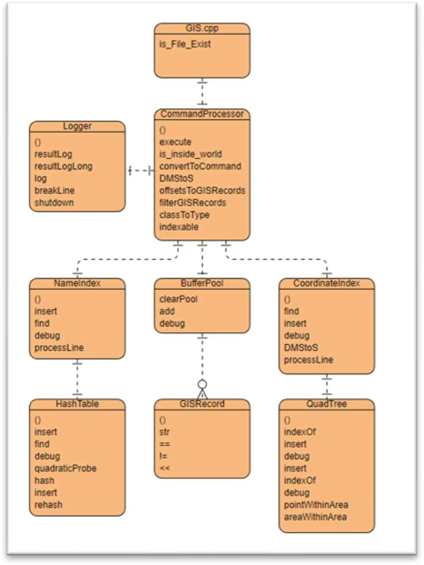

# Geographical Information System
The GIS project stores all specified GIS records within a database file and indexes the coordinates within datastructures, allowing for memory efficient searching of GIS records. Script files are used to interact with the GIS records with commands available for importing data, defining world boundaries, debugging the current state of program, and for querying by feature name, or location within a region.

## How to run:
Compile:	g++ -std=c++11 GIS.cpp -o GIS
Run:	./GIS \<database file name\> \<command script name\> \<log file name\>

## How It's Made:

**Tech used:** C++

The GIS project allows for storage of GIS records within a database file and saves the offsets and coordinates to a quadtree and the offsets and feature name/state abbreviation to a hashtable. When searching for a GIS record through feature name/ state abbreviation the hashtable is used. When searching by specific coordinate or by an area, the quad tree is used. The offsets returned by these searches are then retrieved from the database file and made into GISRecord objects. These objects are logged and stored within the bufferPool. The bufferPool stores the last 15 results from queries. Debugging commands are also available to print the state of the pool, hashtable, quadtree, or world.

**Entity Relationship Diagram**

## Lessons Learned:

First and foremost, the implementation of a quadtree and hashtable for coordinate and feature-based searches proved to be a strategic decision. Leveraging a quadtree for spatial queries and a hashtable for efficient retrieval based on feature name/state abbreviation significantly improved search performance. The importance of maintaining a balance between data structures became evident, emphasizing the need for tailored solutions to specific use cases. 

The implementation of a bufferPool to store and manage the most recent 15 query results was instrumental in optimizing repeated queries, reducing redundant database accesses. This lesson underscores the significance of caching mechanisms in enhancing system responsiveness. Furthermore, the incorporation of debugging commands to print the current state of critical components such as the pool, hashtable, quadtree, and world proved invaluable during development and testing phases. These commands played a crucial role in diagnosing issues, validating system behavior, and ensuring the overall integrity of the GIS project. In summary, the project underscored the importance of thoughtful data structure selection, result organization, and debugging tools in building a scalable and maintainable GIS system.

## Available Commands:
| Commands        | Description           |
| ------------- |------------------------------------------------------------------------------|
| World:        | Coordinates are converted into total seconds and saved for future validation. |
| Import:       | Parses each line of the import file and checks if they are within the bounds set by the world command. If they are the line is saved to the database file and inserted into the NameIndex’s hash table and the coordinateIndex’s quadtree. |
| Debug:        | The debug command logs the current state of its argument.      |
| What_is:      | Queries the nameIndex for the corresponding indexes of the feature name state abbreviation combination. If any results are found, they are converted to GISRecord objects and sent to the bufferPool and logged. |
| What_is_at:   | Queries the coordinateIndex for the corresponding indexes of the latitude and longitude combination. If any results are found, they are converted to GISRecord objects and sent to the bufferPool and logged.      |
| What_is_in:   | Queries the coordinateIndex for the corresponding indexes of the area given. If any results are found, they are converted to GISRecord objects and sent to the bufferPool and logged. |

## Limitations:

•	Debug world can only display 9 features within one tile before malforming the display.

•	No support for “looped” world boundaries eg. north bound with lower latitude than south bound.
